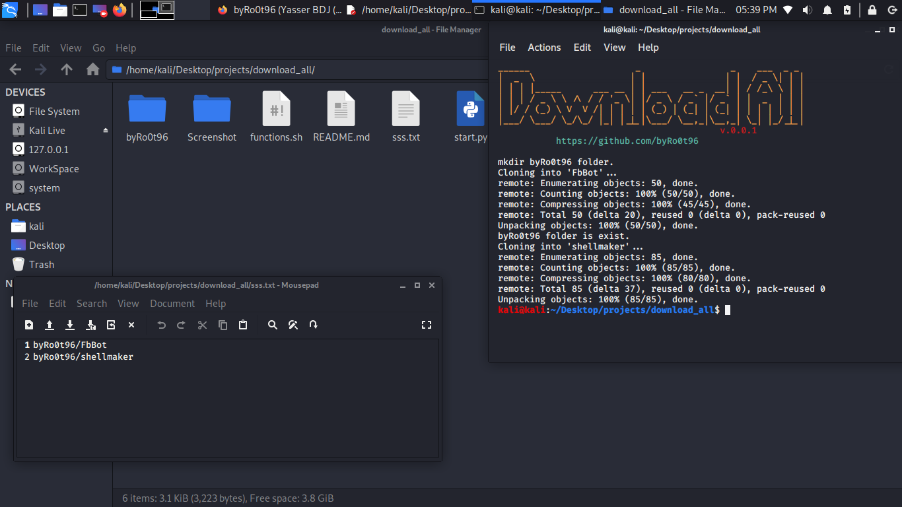

# download_all
'download all' for download a list of Repositories from github using .txt file.

<div align="center">
    <!--a href="" target="_blank"-->
        
    <!--/a-->
</div>
<!---->


### Languages :
* BASH
* python

### System :
* Linux

# Requirements
[✓] subprocess
[✓] os
[✓] sys


# How to get this tool
```
git clone https://github.com/byRo0t96/download_all.git
cd download_all
```

# How to run after download
```
python start.py exemple.txt
```

# Usage
use the command 'python start.py exemple.txt'.
you can find all the downloads in 'username of Repositories' folder.
type of list in .txt file is 'username/Repository_name'


# SUPPORTED DISTRIBUTIONS
|Distribution | Version Check | supported | status |
----------|-------|------|-------|
|Kali Linux|2020.1 | yes | working   |


## Release History
```
[◉] Version 0.0.1 [04-04-2020]
...
```


### Contact :
##### Mail : by.root96@gmail.com

## License
Copyright (C) 2010 - 2020 [byRo0t96](https://byro0t96.github.io/)

